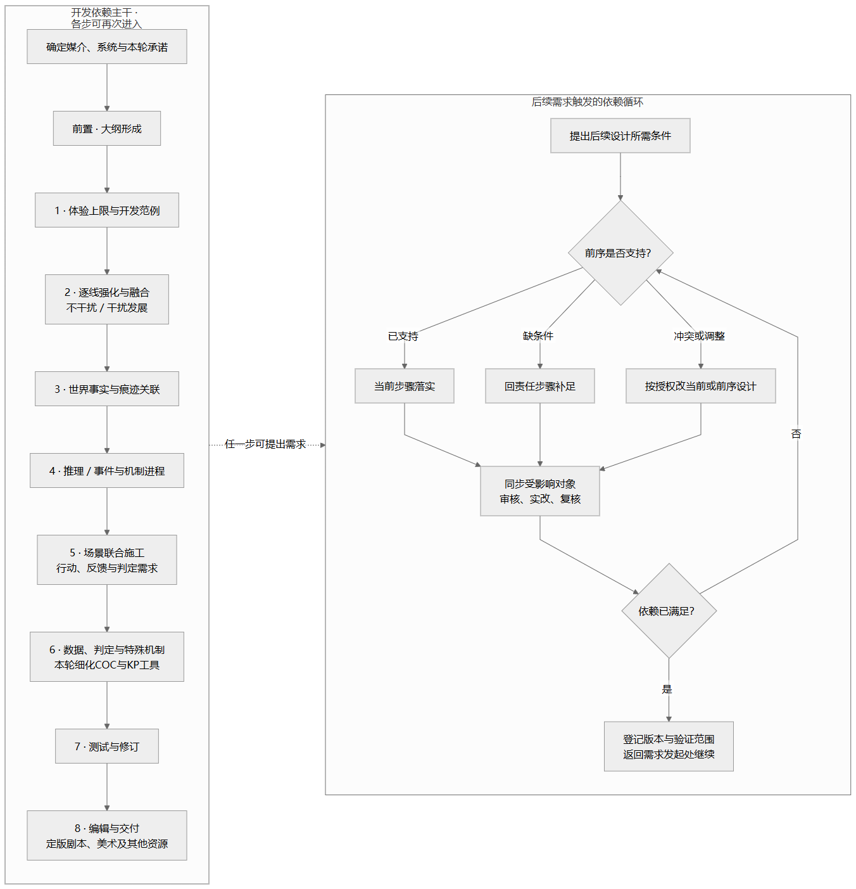
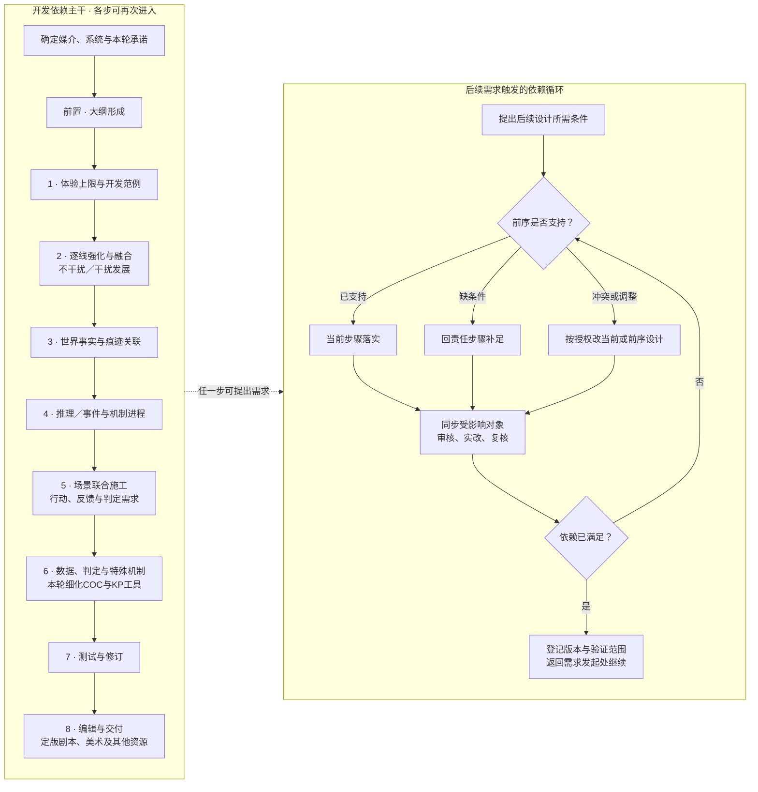

# 开发流程：输入、工作、交付、验收与返修

本页用于安排一轮或一个阶段的开发。任务分流见[范围](scope.md)，记录字段见[字段与例子](contracts.md)，审核标准见[验收](review.md)。

先选媒介和本轮交付目标，再进入相应步骤。以下“前置＋八阶段”以调查型互动／COC为例说明开发依赖；每一步可因后续需求再次进入，玩家可以按实际选择探索故事。

文中“母版”指项目当前采用的故事总稿；“基线”指本轮修改应遵循的已采用内容；“施工”指把设计落实为场景、地图、材料和裁定。局部任务从相应步骤开始，不必重做全流程。

来源修订：2026-10-11，完整流程v1.17；本轮细化第2步干扰发展及第6步COC数据、判定和特殊处理机制；后续依赖循环保持。

## 工作流总图

下图以调查型互动／COC表示开发主干，右侧展示后续需求触发的回溯循环，不规定玩家的探索顺序。局部任务从对应步骤进入；其他媒介按后文适配表替换产物。

[查看可缩放SVG](../assets/workflow-overview.svg)。

流程图源码（Mermaid，维护时同步更新图片）

主干实线表示依赖，右侧实线表示需求处理，虚线表示各阶段均可发起回溯。已满足的设计继续落实；新增条件、冲突或合理调整回责任步骤处理。阶段审核和独立验收按当前承诺执行，固定事实修改仍按项目授权。

时间与节奏评估贯穿阶段，主题按需选用。前序建立因果与行动需求，第6步设计游戏数据、判定和特殊处理机制；本轮仅细化COC规则工序。最终资源归第8步，图只作导航。

## 媒介与任务适配

| 作品类型 | 主要工作顺序 |
|---|---|
| L1一般剧本 | 项目约定→故事大纲→叙事顺序与场景→正文→冷读／指定媒介验证→修订交付 |
| L2互动游戏 | 体验目标→人物因果与条件→世界事实→信息与事件进程→场景接口→规则实现→运行测试→交付 |
| L3调查型COC | 使用后文完整主干，按需要加入异常、COC裁定与主持材料 |

一般剧本借用人物因果、空间和表达方法，交付观看顺序与场景正文。悬疑作品按叙事视角安排材料和揭示，作者可以安排行动。

数字互动交付可实现的条件、状态和反馈接口；实际引擎实现与测试按任务另做。非调查游戏在第4步设计信息和事件进程即可。

各步建立依赖，也允许反馈返修。前序提前核验决定故事可行性的规则、时代或工程边界，具体游戏数据和判定设计集中第6步；不能以未核规则为已成立前提，也不要求前序完成全部数值。

**如何使用后文模板：**后文详细步骤以调查型COC为例。其他媒介先用下表确定本步应交付的内容，再借用该步适合的工作方法。完整开发沿用前序产物与现有约定；局部任务只补核必要输入。

某个专用工序不适用时，注明原因及其功能由哪里承担即可。例如，一般剧本在第6步整理正文和制作标注，无需制作KP手册；非调查数字游戏在第4步整理事件进程，无需编推理分册。

| 对应步 | 一般非互动剧本：产物与完成依据 | 数字互动文案／接口：产物与完成依据 |
|---|---|---|
| 前置 | 主题、人物与故事母版；主要因果成立，假设与固定内容清楚 | 体验、人物与互动母版；起始前提、选择起点及状态后果清楚 |
| 1 | 观看顺序与代表场面；人物行动、转折和余波可复述 | 可达的代表体验路线；玩家信息与动作连续，其他选择可成立 |
| 2 | 各线及事件因果、时序；人物所知和行动连续 | 各线、条件和时序基线；执行与取消有实际后果 |
| 3 | 场景、对象、位置及可见信息；演出／拍摄所需因果有依据 | 世界事实、状态与接触条件；可达性及状态形成／保留可解释 |
| 4 | 叙事顺序与观众信息释放；按视角揭示，悬疑时另核证明 | 事件／信息进程及入口出口；必要条件与状态一致，调查时才加推理分册 |
| 5 | 指定格式场景正文；冷读能理解行动与因果，可演／可见问题已定位 | 场景文本、动作与状态读写接口；正常、拒绝／偏离、取消和重复的纸面走查一致 |
| 6 | 同版正文与必要制作标注；角色、场景、格式及引用一致 | 按实际系统设计数据、裁定及特殊处理，整理状态／规则接口；未实现与未运行范围明示 |
| 7 | 按承诺冷读、同行审读或排演；修复本轮问题，记录实际验证范围 | 文本与状态走查、受影响复测；引擎运行、用户测试仅在已实施时登记，文案包通过不称游戏可运行 |
| 8 | 同版本源稿、索引与交付说明；目标格式及未测范围可查 | 实现方接口包、玩家可见内容及版本说明；ID、状态、内容与依赖一致，秘密不进入玩家文本 |

**其他桌面互动：**复用因果、信息与节点方法，裁定采用实际游戏系统。第4步选择调查证明或事件进程；第5—6步制作主持样段与工具；第7步按约定测试；第8步分发主持与玩家各自需要的材料。统一节点和字段可以复用，COC专用规则按系统需要选择。

**非调查COC：**保留参与、人物、条件、异常／系统和主持目标。第4步整理事件、信息、消息与状态进程；第5—6步制作COC场景、裁定和主持材料；第7步按承诺验证；第8步分主持与玩家内容。怪物公开的救援任务可以直接围绕救援行动展开。

**验证到哪一步：**按本轮承诺区分文本候选、接口包和可运行成品。文本候选可通过纸面验收；完整可主持的COC成品需要已核关键规则、完整默认裁定，并记录实际非作者运行资格。可运行数字交付需要实现和运行证据。

真人桌测、排演、用户测试分别记录实际资格。完成约定范围即可交付，范围外列为未测。详细标准见[验收](review.md)。

## 后续需求与前序设计的循环

前置＋八阶段表示开发依赖，不表示各阶段只做一次。循环的主要触发是后续设计需要前序条件得到落实、补足或修改；阶段审核仍按当前承诺执行。某阶段通过，只证明该对象在当时范围内通过，不永久关闭该阶段。

1. **提出需求。** 当前场景、机制、配置或测试说明需要什么条件、来自哪个对象，以及不满足会影响什么。例如切断供电的行动需要可接近的设施，停电后哪些事件应改变。
2. **核对现有前序。** 先检查当前采用版本，不因当前页面未写就断言不存在。按下表决定工作位置。
3. **落实或修改。** 已有支持在当前步骤实现；缺条件回责任阶段补足；冲突或改进按授权调整当前方案或前序设计。改变母版固定事实另记差异，不自动解冻。
4. **同步与复核。** 更新受影响的因果、事实、机制、数据、信息进程、场景及工具；只更新实际相关对象。复核需求是否满足、旧有行动与成果是否仍成立，记录新版本、修改范围及未测项。
5. **返回需求发起处。** 使用同版本结果继续当前工作。仍未满足的决定性依赖保持阻断；可独立推进的部分继续，不虚构前提，也不无故重跑全流程。

| 前序检查结果 | 执行动作 | 继续依据 |
|---|---|---|
| 已支持，尚未落实 | 在当前场景或配置中引用并实现 | 行动、反馈和结果与既有条件一致 |
| 缺少必要条件或数据 | 回负责该事实、机制或配置的步骤补足 | 所需条件有依据，相关数据可用 |
| 存在冲突或需要调整设计 | 比较改当前方案与改前序的影响，按授权实改 | 因果和约束成立，受影响对象复核通过 |

返修位置按问题归属，见后文“工作循环与返修”。不把所有缺数都退回第2步；前序因果／事实问题回相应步骤，具体游戏规则、判定、数据与特殊处理在第6步设计。填数若改变原先假设的能力、耗时、成本或结果，应重新核相关设计。

最小记录可合入既有问题表：需求及发起位置、依赖对象／版本、缺口或冲突、处理位置与理由、采用修改、影响范围、复核结果与继续位置。小修只记实际涉及项。

**停点：**当前需求已满足、相关改动复核通过且本轮交付完成即可收束。未实现的设想和未测范围保留为开放项，不为了“完成循环”虚报通过。独立验收按项目约定审核本轮对象与影响范围，不自动把全部历史内容重新验收。

## 按游戏选择机制与配置任务

通用流程复用故事、因果、信息、空间、场景和验证依赖；游戏机制、裁定方式和具体数据按所选游戏决定。无规则的叙事作品无需填游戏数值；其他TRPG、数字互动或自定义游戏不默认采用COC检定、SAN、战斗或追逐。

区分三项工作：**机制设计**确定玩家行为怎样改变条件、状态与结果；**规则适配**确定所选系统怎样裁定这些行为；**数据配置**在已确定机制下填写本项目需要的角色、物品、敌人、状态及参数。前序设计故事条件、行为后果和场景需求，第6步集中进行具体系统规则适配、数据与特殊处理机制设计；不新增阶段或通用数值模板。本轮COC细节见[第6步专页](coc-rules-design.md)，其他系统只保留适配接口。

| 阶段 | 按需执行的机制／数据工作 | 完成依据 |
|---|---|---|
| 前置 | 确定媒介、所选系统与版本或自定义边界；记录决定核心故事可行性的规则约束 | 采用范围明确，决定性未知不作为已成立前提 |
| 1 体验 | 提取路线需要的玩家行为、玩法和结果；必要时核关键能力 | 代表路线在所选游戏中有成立依据 |
| 2 因果 | 设计机制目的、前件、变化、干预和后果，联查人物知情 | 机制支持故事因果与真实选择 |
| 3 世界 | 落实机制所需实体、空间、事实、状态来源及接触条件 | 场景所需条件可存在、可接近、可改变 |
| 4 进程 | 接入触发、状态更新、时间、反馈和取消条件；调查时再接推理目标 | 事件与机制接口一致，提前成功持续生效 |
| 5 场景 | 落实行动、场景前提与反馈，列待配置判定和数据；按已知条件走查 | 样段因果与接口清楚，待设计项明示；未完成裁定不称可主持定稿 |
| 6 系统设计与工具 | 设计游戏数据、判定、特殊处理及默认实现；本轮细化COC，提取KP表与手册 | 配置有依据且支持前序进程，可调／待核明确，使用者无需补决定性设计 |
| 7 测试 | 按承诺验证规则和配置，发现问题返回责任步骤，修改后复测 | 当前验证证据绑定实际对象与配置版本 |
| 8 交付 | 汇总定版剧本文稿、美术及其他资源，并附规则、配置、源稿与使用说明 | 所需资源齐全、同版、权限及未测范围可查 |

前序须及时核验决定故事可行性的规则边界；具体数值、判定和特殊处理在第6步设计并反查前序。未经核验的决定性数据不作已成立前提，第6步不是仅做收束。仅文本／接口交付注明待实现和未运行范围，不能冒称完整游戏已可运行。

填写数据先确定当前对象需要哪些字段，记录字段含义、单位或取值类型、默认值及依据、适用条件和版本；只填当前需要的项。具体规则来自实际系统或明确标注的项目自定义设计；缺来源或决定性数值时登记待核及影响，不臆造“通用标准值”。没有某类机制时，说明不适用，不强填空表。

美术、剧本及其他最终资源归第8步交付，不另建资源开发阶段。前序用于验证的正文、地图或手证样稿是设计依据；最终资源若改变信息、操作或反馈，按影响回原设计及第7步复核。

## 前置：大纲形成

这一步先让故事成立：谁想做什么，为什么现在发生，参与者可以改变什么。

输入：项目约定、核心需求、已有事实与素材。

工作：

1. 确定题材、时代、形式、人数、篇幅或时长，以及本轮体验目标。区分进入故事的前提与进入之后的选择。
2. 建立核心概念、主题、现实处境、历史因果、当前冲突，以及人物的诉求和知情。涉及异常时说明异常规律。
3. 判断需要哪些支线、各自承担多大分量。必要时研究和发散，先让每条故事成立，再建立联系，并检查揭晓之后如何继续推进。
4. 写成连续母版，按领域审核、实改复核，登记为当前采用基线。

交付：故事、人物、异常与推理潜力母版、主支线关系、确认／候选／开放项。

完成：故事可复述，人物行为有依据，互动机会与结果方向可解释。施工细节未做不等于失败；影响核心因果的硬矛盾不能推迟掩盖。

## 第1步：完整体验上限与开发范例

这一步写出一条确实可达的代表路线，用它检验体验是否完整。

“体验上限”指设计希望呈现的一条充分展开的路线，不要求全解、全活或最大成功。以下按玩家视角写作，即只使用该玩家组当时可取得的信息。一般剧本改用观看顺序，见[媒介适配](#媒介与任务适配)。

输入：已验收母版、保留情节、体验目标。

工作：

1. 对照已有材料，检查早期关键情节是否遗漏、弱化或改变顺序。
2. 先写总览、人物定位与代表情节，再按体验转折分阶段。连贯写出事件、动力、探索、交谈、发现与推理、选择后果和亮点。
3. 此时写清阶段问题与行动类别；具体问话与微动作留到第5步场景设计，具体骰点与数据由第6步配置。

检查推理、操作／博弈、人物剧情和氛围是否在路线中实际发生。示例里的危机要有成立前提；其他合理成功可能取消它。另写基础或偏离走查，确认其他合法选择也能成立，既保留真实冲突，也兑现提前成功。

交付：玩家视角的完整代表路线、从体验提取的设计需求、基础／偏离及提前成功走查，以及必要的母版差异提案。

完成：无需母版／KP附件即可复述全发展、关系变化、亮点与重要选择；材料、认识和行动连续；冲突强度与可读性分别通过。母版改变按既有授权处理，不把新呈现或待核载体升为历史事实。

## 第2步：逐线强化、融合与干扰发展设计

这一步强化各线，再明确不干扰与各类干扰下的发展和结果。各媒介可使用因果方法，互动作品增加玩家干扰；具体游戏数据与判定由第6步设计。

输入：母版、体验需求、人物与时空约束。

工作：

1. **强化并融合各线。** 补强诉求、矛盾、选择、变化与回收，按[叙事](narrative.md)核跨线作用，互动联系按需读[七类联系](investigation.md#seven-links)。
2. **建立不干扰参考进程。** 写初始状态、人物目标与实际所知、资源、触发／时间条件、发展和结果。无人介入也不等于必然发生；人物未获消息或条件失效时不能按排程保送。历史事件保留事实先后。
3. **识别并归类关键干扰。** 找会改变成立、推进、取消、结果或其他线的条件；按时点、方式、对象与实际效果组织，不穷举所有玩家动作。
4. **推导干扰发展。** 写被改变及仍成立的条件、新进程、窗口与结果；保留实际成果。部分达成、未达目标、中断和反作用是因果效果，不预设为游戏统一成功等级。
5. **联查跨线与信息。** 核时间、并发、互斥、资源和人物知情／相信／行动；分别更新线索生成、保存、接触和理解条件，改变一项不自动删除全部既有证据。
6. **走查与交接。** 按本线实际需要检查不干扰、有效干扰、未达目标但留下变化、提前或中途干扰；自由动作按改变的条件推导。列第6步所需判定、耗时／成本及特殊处理需求。

### 干扰分类与最小记录

| 分类轴 | 按需检查 |
|---|---|
| 时点 | 发生前、进行中、完成后；提前、迟到、窗口关闭 |
| 方式 | 调查、告知／误导、协商／帮助、阻断／破坏、转移／保护、直接行动 |
| 条件对象 | 知情与意愿、人员、物件、设施、路径、资源、时间 |
| 效果与范围 | 条件未变／部分改变／完全改变、附带变化；单线、跨线、共享资源与并行行动 |
| 延续 | 重复、恢复、补救依据及其耗时／成本 |

最小记录合入事件或支线稿：ID／版本、不干扰条件与进程、干扰窗口与方式、实际改变／未变条件、后续发展及结果、跨线／知情／信息影响、第6步配置需求。正文保持连贯，不用空卡替代故事。

交付：强化稿、无干扰参考进程、关键干扰发展与结果、跨线和时间／因果图、信息影响、配置需求及必要母版差异。

完成：各线独立成立且融合有实际效果；干扰确实改变相关后续，提前成果持续有效；补救有能力、时间与资源依据。先逐线再全局核验，固定事实改动按授权处理。第3—5步落实实体、进程和场景，第6步以实际规则反查本步。

## 第3步：世界事实与痕迹关联

这一步把事件落实到空间、物件与可观察结果。一般剧本关注场景和可见信息，互动作品还要检查接触条件。

输入：因果基线、体验需求与既有空间约束。

工作：

1. 确定事件发生位置、人员如何接近、物件去向，以及身体、设施和环境的变化。
2. 区分必然结果、条件结果和可选实现。逐项检查痕迹能否存在、保存、接触、辨认和发现。
3. 对历史痕迹说明后续修补、使用、破坏、遮盖或污染；对当前事件说明干预后哪些痕迹改变或不再产生。

交付：事件—事实／痕迹表、生命周期、观察知情、位置约束、条件结果与备选实现。

完成：无凭空谜底载体；痕迹有形成与延续理由；因果所需空间成立。此时固定足够位置关系，之后结合体验与推理反向影响地图布置，不先填满房间迁就情节。

### 第3步的后续返工

按[后续需求循环](#后续需求与前序设计的循环)回溯，以下补充本步的事实边界。

后续推理、地图、场景、规则或测试提出合理优化需求时也可返回本步，不限硬矛盾。事实／来源／留存与继承关系改变时更新本步，涉及人物动机或事件因果则联查第2步；仅提供位置或呈现方式改变且事实未变，修改相应后续产物即可。同步受影响时点、空间、知情、材料、目录和两分册／场景，按影响复核并登记新版本。母版修改权限另按项目约定，第三步返工不自动解冻母版。

## 第4步：推理章程与统一进程

调查任务在这一步说明玩家怎样形成并修正推论，同时协调事件进程。非调查任务整理事件与信息即可；一般剧本安排观众信息释放。适用产物见[媒介适配](#媒介与任务适配)。

“推理章程”指调查信息与推论的设计说明；“分册”是按职责组织的材料，可以是独立文件，也可以是同文档中的章节。

输入：体验目标、因果基线、世界关联。

工作：

1. 分别整理推理线索和事件节奏，各自检查后合成。共用编号（ID）、版本和状态，并保留一个权威查阅入口。
2. 按[推理设计](inference-design.md)第8节调用合同，从剧情需求拆目标，分别安排事件与单目标认知、多轴线索、充分组合和阶段提供方式；第9节A—G模板提供目标、线索、实际接收者、事件整合、运行接口、三类边及验收记录。仅分析时交诊断，完整阶段须交连贯分册与共用登记。七类联系按需读[调查](investigation.md#seven-links)。
3. 按[互动](interactive.md)设计事件前提、预警、时间窗口、更新和推动方式。
4. 检查累计信息、跨线组合与提前获得信息时，进程是否仍然成立。

交付：完整分册、认知进程、释放安排、线索集合、事件条件、合成索引及接口记录。

完成：解释通常知道什么、怎样形成推论、缺什么、理解改变什么；乱序、漏线索、误判及提前成功有依据继续；章节安排不否认实际事实。

### 两分册与节奏的接口

推理分册调用[推理能力](inference-design.md)设计目标、证明、路径和投放；事件／节奏分册接收活动时间账本、阶段目的、积累—释放与真实恢复需求，并与事实、事件、线索、认知目标ID连接。现实过程与世界时间分开，单主持分队按资源排程，个人等待不重复计入墙钟；条件改变后重算后续时间、后效和疲劳，兑现取消成果。

合成时两分册各自完整、共用ID和版本，只留一个权威入口；目标—事实—线索—出现／公开条件—行动—后果可追溯。局部分析按调用合同交受影响范围，不硬交整阶段两册。题材与主题字段按[主题规范](theme-presentation.md)选用。

### 沿阶段调用时间评估

[节奏能力](play-evaluation.md)第18节可独立调用。大纲给目的、粗范围和缺口；第1步还原合法路线与体验机会；第2—3步核因果、空间与耗时前提；第4步连活动、事件和线索；第5—6步以样段和运行依据细化；第7步分栏记录预测、实际行为与自报并校准；第8步保留配置及证据。修改时长、信息量、活动、路线或目的后，更新受影响段及后续累计状态。完整公式、参数、工作表和展示只在能力正文维护，主剧情稿保留连续阅读。

## 第5步：地图、场景、细节与线索联合施工

这一步把设计写成可接触、可行动的场景。一般剧本交付可演／可见的正文；数字互动交付文本与状态接口；桌面互动交付主持样段。完成依据见[媒介适配](#媒介与任务适配)。

输入：前四步成果。

工作：

1. 同批落实区域、动线、视听信息、物件、NPC活动、线索、条件反馈、合作与背景呈现，使用同一套节点记录。
2. 联合检查空间、物性、视听、人手、搬运、时序和行动机会。
3. 写完整场景样段，带齐地图、角色、材料、条件与后果；列第6步待设计的裁定和数据。先按已知条件走查正常和偏离，再分批扩展。若本轮承诺可主持样段，须先完成相关第6步设计并返回本步复核。

交付：场景设计稿、地图与手证样稿、人物运行、局部状态、裁定／数据需求及扩展稿；可主持样段仅在相关裁定已完成时登记，定版资源归第8步。

完成：信息可按指定条件取得，自由行动和状态反馈的因果与接口成立。承诺可主持样段时，须完成相关第6步设计并返回本步复核，再按约定实际验证；未实施不授运行资格。

## 第6步：游戏数据、判定与特殊处理机制设计

这一步根据前序发展与场景设计具体游戏数据、判定和特殊处理机制，再整理查阅工具，不仅收束。一般剧本整理正文和制作标注，不强填游戏数值；其他系统按实际规则适配，本轮只细化COC。

输入：第2步干扰／不干扰发展，第3步实体与载体，第4步事件／推理进程，第5步场景行动与配置需求，以及已核规则边界。

工作：COC任务读取[COC第6步专页](coc-rules-design.md)，执行规则约定→调查员与对象数据→行动／线索分类→基准判定→RP与现场调整→结果及特殊处理→KP表与复核。复用原场景、事件与线索ID；关键配置有依据，默认和可调范围明确。数值或机制不支持前序发展时按[依赖循环](#后续需求与前序设计的循环)返回责任步骤，更新后回本步复核；不得在手册临时补决定性设计。

交付：COC默认数据／判定表、特殊处理机制、事件回写与复核结果、KP手册候选；其他媒介按适配表交付。

完成：数据和裁定支持事件与推理进程，失败、提前成果及重复处理成立；同机制各查阅入口一致，未核与未测明确。具体COC验收见专页第4节，实际运行资格另按第7步登记。

## 第7步：测试与修订

这一步按本轮承诺验证实际产物，修复问题并复测受影响部分。

输入：同版本手册、主持与玩家材料。

工作：依[验收](review.md)选择本轮约定的冷读、反例走查、非作者运行或真人桌测，记录实际行为及KP补充。定位问题、实改，再按影响复测。审核主持包时，检查手册是否支持关键场景与一次偏离。

交付：相应测试证据、问题响应、修订与未测范围。

完成：本轮阻断已修，重要体验问题得到处理和相关检查；AI审稿、AI模拟、实际KP与真人测试不互代。

## 第8步：编辑与交付

这一步让接收者找到同版本材料，并知道怎样准备、使用和结束。各媒介的交付对象见[媒介适配](#媒介与任务适配)。
输入：达到约定验证范围的同版材料。

工作：按约定汇总定版美术、剧本文稿与其他资源，分主持／玩家或实现方所需材料、核泄密，统一名称、ID、地图、手证与索引，附源稿、变更、配置、覆盖与限制。不同规格分别说明删改依赖与测试。

交付：可编辑源稿、可主持或测试包、玩家材料、版本记录与交付边界。

完成：资产一致，使用者知道准备／启动／结束方式；未测规格与时长不写成已验证承诺。

## 工作循环与返修

后续需求先按[依赖循环](#后续需求与前序设计的循环)处理，再按当前承诺执行“编制→审核→实改→复核→登记基线”。需要深度探索多个方案时，使用[技巧](craft.md)的七步循环。

场景施工按批推进：恢复当前基线，写一批，走查常规和偏离，修复问题，检查受影响的地图、手证等材料，登记完成范围。独立审核或逐步验收按用户约定执行，记录实际结果。

| 问题根源 | 返修位置 |
|---|---|
| 体验本身不足、不可读、冲突没有展开 | 第1步／正文 |
| 动机、跨线、时序、知情矛盾 | 第2步 |
| 痕迹来源、生命周期、位置不成立 | 第3步 |
| 证明断路、释放失衡、错误解释难修 | 第4步 |
| 接触、操作、提示或查阅困难 | 第5步／第6步 |
| 机制前件或行为后果缺失 | 相应原设计；因果第2步、事实第3步、进程第4步 |
| 缺少游戏数据、裁定或特殊处理 | 第6步；联查第5步行动与第2／4步进程 |
| 数值改变能力、耗时、条件成功或结局 | 联查其影响的原设计及第5—6步 |
| 母版事实必须改变 | 单列差异和影响，按项目授权处理 |

保留成立部分，按影响复核，不为守冻结文本保矛盾，也不无故重跑整部开发。每轮交代做成什么、受众／玩家因而可经历或做什么、材料怎样支持理解、哪里未验证。
